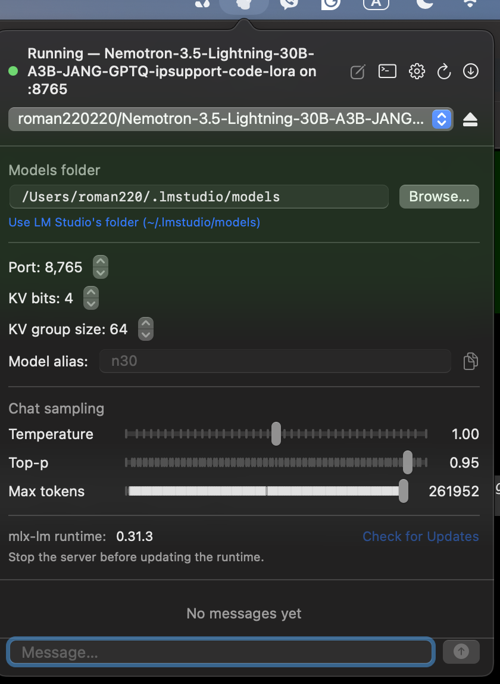

# LLMTray

A native macOS menu bar app for running local LLMs with [mlx-lm](https://github.com/ml-explore/mlx-lm) on Apple Silicon — a proper interface instead of a shell script and a terminal tab.

<p align="center">
  
</p>

<p align="center">
  <a href="https://github.com/ipsupport-llc/llmtray/releases/latest/download/LLMTray.dmg"></a>
  &nbsp;
  <a href="https://github.com/ipsupport-llc/llmtray/releases/latest/download/LLMTray-Full.dmg"></a>
  <br>
  <sub>Light — ~2MB, needs Python 3.10+ already on the machine &nbsp;·&nbsp; Full — ~260MB, self-contained</sub>
  <br><br>
  <a href="https://ipsupport-llc.github.io/llmtray/">ipsupport-llc.github.io/llmtray</a>
</p>

## What it does

- **Start/stop `mlx_lm.server`** from the menu bar, against any model in your models folder (`~/.llmtray/models` by default, configurable in Settings — point it at `~/.lmstudio/models` to share models already downloaded via LM Studio).
- **Browse and download models from Hugging Face** right from the app — search, see file sizes, download with a real progress bar (speed, ETA, pause/resume), and a size check on every file so a truncated download doesn't quietly pass as "done."
- **Chat** against the running server (OpenAI-compatible `/v1/chat/completions`), with streamed `<think>` reasoning shown separately from the final answer, tok/s, and per-chat sampling settings (temperature/top-p/max tokens).
- **Menu bar icon reflects real state**: green + pulsing while anything is generating (this app's own chat *or* an external tool hitting the server directly), orange/red on real thermal pressure (`ProcessInfo.thermalState`), pulled independently so one signal never hides the other.
- **Live server log** in its own window, and a quick right-click menu (start/stop, quit) for when you don't need the full chat window.
- Runs mlx-lm from **our own fork** ([`ipsupport-llc/mlx-lm`](https://github.com/ipsupport-llc/mlx-lm), see [`runtime/`](./runtime)) at a pinned commit — never mlx-lm from PyPI (its dependencies do come from PyPI) — with an in-app update check against the fork's `main` branch.

## Requirements

- macOS 13+, Apple Silicon.
- Xcode command line tools (`swift build`) — no full Xcode project needed.
- **Python 3.10+** somewhere on the machine (Homebrew, pyenv, MacPorts, Anaconda/Miniconda, or python.org) — used once to create the `mlx-lm` venv in `runtime/`. The macOS-provided `/usr/bin/python3` (Xcode Command Line Tools, currently 3.9.x) is too old: `mlx` doesn't publish wheels for it, so the first-run setup fails with a `pip` "could not find a version that satisfies the requirement mlx" error if that's the only Python installed. LLMTray looks for a newer interpreter in common install locations automatically; it only falls back to the CLT one if none of those exist.

## Quick start

Two DMGs are attached to every [release](https://github.com/ipsupport-llc/llmtray/releases/latest):

- **[LLMTray.dmg](https://github.com/ipsupport-llc/llmtray/releases/latest/download/LLMTray.dmg)** (~2MB) — sets up the `mlx-lm` venv on first launch (needs a Python 3.10+ already on the machine; see [Requirements](#requirements)).
- **[LLMTray-Full.dmg](https://github.com/ipsupport-llc/llmtray/releases/latest/download/LLMTray-Full.dmg)** (~260MB) — ships its own Python + `mlx-lm` already installed, so first launch needs nothing else on the machine and starts serving immediately.

1. Download one of the two above and drag it to Applications.
2. First launch (this build isn't notarized): open it once, then **System Settings → Privacy & Security → "Open Anyway"** (macOS 15+; on macOS 13–14, right-click the app → Open also works). Or in Terminal: `xattr -dr com.apple.quarantine /Applications/LLMTray.app`.
3. Click the brain icon in the menu bar and pick a model (or download one via the built-in Hugging Face browser if you don't have one yet) — the server starts on its own from here, both right now and on every future launch.

The very first start creates the `mlx-lm` venv and installs our fork automatically (see [`runtime/`](./runtime)) — that takes a minute and shows progress in the server log window; every launch after that is instant. Changed your mind about the model? The small eject/play button next to the picker stops or restarts the server without needing to quit the app.

The app looks for models under `~/.llmtray/models/<publisher>/<model-name>/` by default (configurable in Settings; the layout matches LM Studio's own `~/.lmstudio/models`, so pointing it there works too) — either point it at models you already have, or use the in-app Hugging Face browser to pull one down.

### Building from source

```bash
git clone https://github.com/ipsupport-llc/llmtray.git
cd llmtray
swift build
.build/debug/LLMTray
```

## Why our own mlx-lm fork?

Stock (PyPI) `mlx_lm.server` is missing things this app relies on, and [`ipsupport-llc/mlx-lm`](https://github.com/ipsupport-llc/mlx-lm) carries them natively:

- `--kv-bits` / `--kv-group-size` / `--quantized-kv-start` for KV-cache quantization (lets a bigger model's context fit in less memory), plus `--model-alias` and an `/api/v0/models` alias for LM Studio-shaped clients.
- NemotronH Multi-Token-Prediction self-speculative decoding, and `RotatingKVCache` quantization support (upstream raises `NotImplementedError`).
- Native support for prism-ml's Hadamard-rotated, 2-bit ternary "Bonsai 2" checkpoints (`prism_hadamard_qwen35`) — loads them at full native precision with no separate conversion step.

`runtime/run_server.sh` installs a pinned commit of the fork's `main` branch (`runtime/mlx_lm_runtime.json`) — see the doc comment on `RuntimeManager.swift` for why the pin isn't auto-tracked to the branch tip on every launch.

## Architecture

```
Sources/LLMTray/
├── LLMTrayApp.swift       menu bar item, icon state, right-click menu, SIGTERM handling
├── ServerManager.swift    starts/stops mlx_lm.server, captures its log, busy detection
├── ChatClient.swift       OpenAI-compatible SSE streaming client
├── HFModelBrowser.swift   Hugging Face search + resumable downloads
├── RuntimeManager.swift   pinned mlx-lm fork commit + update check
└── ...
runtime/
├── run_server.sh          self-contained venv bootstrap + fork-based server launcher
└── mlx_lm_runtime.json    pinned mlx-lm fork commit
```

## Status

Working daily driver on a MacBook Air M5. Packaged as a `.app`/`.dmg` via [`scripts/build_app.sh`](./scripts/build_app.sh) and [`scripts/build_dmg.sh`](./scripts/build_dmg.sh), ad-hoc signed only -- Developer ID + notarization is the next milestone (see [Actions](../../actions) for CI build/release status).

## License

Apache 2.0 — see [LICENSE](./LICENSE). Third-party licenses (Sparkle, the bundled Python runtime in the Full build, and the services the chat tools use) are generated at build time by [`scripts/generate_licenses.py`](./scripts/generate_licenses.py) and listed in **About LLMTray**, together with what's installed on your Mac and the licenses of your downloaded models.
