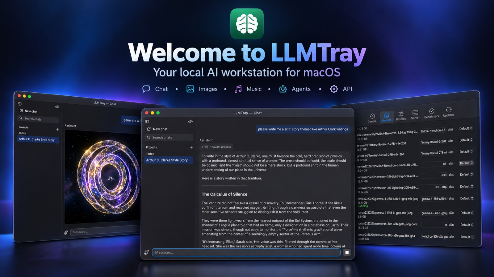

# LLMTray

**Run local AI on Mac.** LLMTray is a native MLX local LLM GUI for macOS, living in the menu bar and built on [mlx-lm](https://github.com/ml-explore/mlx-lm) for Apple Silicon. It gives you a proper interface instead of a shell script and a terminal tab. It also provides:

- an **OpenAI-compatible local API on Apple Silicon** for your apps and **local AI coding agents on Mac**;
- chat with tools;
- **local image generation and editing on Mac**;
- local music generation.

The models run on your Mac. Only the optional web tools reach the internet.

<p align="center">
  
</p>

<p align="center">
  <a href="https://github.com/ipsupport-llc/llmtray/releases/latest/download/LLMTray.dmg"></a>
  &nbsp;
  <a href="https://github.com/ipsupport-llc/llmtray/releases/latest/download/LLMTray-Full.dmg"></a>
  <br>
  <sub>Light — ~8MB, needs Python 3.10+ already on the machine &nbsp;·&nbsp; Full — ~270MB, self-contained</sub>
  <br><br>
  <a href="https://ipsupport-llc.github.io/llmtray/">ipsupport-llc.github.io/llmtray</a>
</p>

## What it does

- **OpenAI-compatible local API on Apple Silicon** at `http://localhost:8765/v1`. A client can name a model in each request, and LLMTray switches to it (without one, the loaded model answers). A setting decides whether outside clients may switch the loaded model, must ask first, or keep what's loaded.
- **Local AI coding agents on Mac.** Point any OpenAI-compatible agent or editor at that endpoint (`OPENAI_BASE_URL=http://localhost:8765/v1`), and the model's profile fills in its sampling defaults.
- **Local image generation and editing on Mac.** The chat model calls Z-Image Turbo or FLUX.2 klein, using our GPTQ checkpoints on Hugging Face, and edits photos with klein. Also local music with sung lyrics (ACE-Step 1.5), and a Creator mode for reviewing a prompt before anything is made. All optional, and downloaded only when turned on in Settings.
- **Chat** with tabs, projects and their instructions, and tools (web search, news, Wikipedia, weather, calculator, …).

- **Start/stop `mlx_lm.server`** from the menu bar, against any model in your models folder (`~/.llmtray/models` by default, configurable in Settings — point it at `~/.lmstudio/models` to share models already downloaded via LM Studio).
- **Browse and download models from Hugging Face** right from the app — search, see file sizes, download with a real progress bar (speed, ETA, pause/resume), and a size check on every file so a truncated download doesn't quietly pass as "done."
- **Chat** against the running server (OpenAI-compatible `/v1/chat/completions`), with streamed `<think>` reasoning shown separately from the final answer, tok/s, and per-chat sampling settings (temperature/top-p/max tokens).
- **Menu bar icon reflects real state**: green + pulsing while anything is generating (this app's own chat *or* an external tool hitting the server directly), orange/red on real thermal pressure (`ProcessInfo.thermalState`), pulled independently so one signal never hides the other.
- **Live server log** in its own window, and a quick right-click menu (start/stop, quit) for when you don't need the full chat window.
- Runs mlx-lm from **our own fork** ([`ipsupport-llc/mlx-lm`](https://github.com/ipsupport-llc/mlx-lm), see [`runtime/`](./runtime)) at a pinned commit — never mlx-lm from PyPI (its dependencies do come from PyPI) — with an in-app update check against the fork's `main` branch.

## Requirements

- macOS 14+, Apple Silicon (v0.7.2 is the last release for macOS 13).
- Xcode command line tools (`swift build`) — no full Xcode project needed.
- **Python 3.10+** somewhere on the machine (Homebrew, pyenv, MacPorts, Anaconda/Miniconda, or python.org) — used once to create the `mlx-lm` venv in `runtime/`. The macOS-provided `/usr/bin/python3` (Xcode Command Line Tools, currently 3.9.x) is too old: `mlx` doesn't publish wheels for it, so the first-run setup fails with a `pip` "could not find a version that satisfies the requirement mlx" error if that's the only Python installed. LLMTray looks for a newer interpreter in common install locations automatically and never uses the CLT one. With none found, first-run setup says so. The Full DMG ships its own Python and needs none.

### Memory

What each model takes while it runs, measured on an M5 MacBook with 24 GiB of RAM (Metal's default GPU limit 17.8 GiB, 19.07 GB) on 2026-09-30 (the image rows 2026-10-01). Peak is the kernel's `phys_footprint_peak` of the runner and its children, which on Apple Silicon includes GPU memory. Harness: [`scripts/measure_memory.py`](./scripts/measure_memory.py); the app reads the same numbers from [`runtime/feature_memory.json`](./runtime/feature_memory.json).

| What | Model | Peak GiB | Time |
|---|---|---|---|
| Chat, 4K / 16K-token prompt | Gemma 4 E2B (QAT) | 5.10 / 5.55 | 6 / 12 s |
| Chat, 4K / 16K | Gemma 4 E4B (QAT) | 7.20 / 7.87 | 12 / 22 s |
| Chat, 4K | Nemotron 3 Nano 4B (ipsupport-code LoRA) | 9.25 | 13 s |
| Chat, 4K / 16K | Gemma 4 26B-A4B (GPTQ) | 16.97 / 17.15 | 25 / 60 s |
| Chat, 4K | Nemotron 3.5 30B-A3B | 19.27 | 17 s |
| Image 1024², 9 steps | Z-Image Turbo GPTQ mixed | 7.83 | 124 s |
| Image 1024², 4 steps | FLUX.2 klein 4B | 4.44 | 28 s |
| Image edit, one 1024² reference | FLUX.2 klein 4B | 6.45 | 70 s |
| Music 30 s / 120 s | ACE-Step turbo 4-bit + 1.7B planner | 7.24 / 8.42 | 33 / 97 s |
| Music 30 s | ACE-Step sft GPTQ 4-bit | 7.15 | 32 s |
| Voice, 20 s listening | VoiceChat 11B GPTQ 3-bit | 9.71 | 70 s |
| Voice, 20 s listening | VoiceChat 11B GPTQ 3-bit + 8-bit speech | 8.73 | 62 s |

The image runner caps MLX's buffer cache at 256 MB (by default MLX keeps freed buffers up to its memory limit: Z-Image peaked at 19.7 GiB that way, klein editing at 17.8) and drops each model once it's done: the text encoder after the prompt; for Z-Image also the transformer -- and the compiled denoising step that holds its weights -- before the VAE decode, which is its peak. Previews decode from half-size latents. Same images, byte for byte. A run's peak can differ by up to ~0.9 GiB between days (the system's memory state); the table keeps the higher.

Not measured yet, so estimated in the JSON from a measured sibling plus the difference in files: Z-Image GPTQ 8-bit and 4-bit, ACE-Step sft 8-bit and full precision. Image, music and voice run alone (the chat model is unloaded for them). Peaks near the GPU limit may be held down by it (MLX frees its cache under memory pressure), so on a bigger Mac they can be higher.

The wizard and Settings gate image generation, image editing and music by these peaks: under the GPU limit a model fits; over it but within the RAM less 4 GiB for macOS (as far as the limit can be raised) it's offered with a warning; beyond that it can't be turned on, and says how much it needs. Voice Lab sets its peak against the GPU limit with its own check (a 1.5 GB margin, the chat model beside it) and offers no download of a model that can't run even with a raised limit.

## Quick start

Two DMGs are attached to every [release](https://github.com/ipsupport-llc/llmtray/releases/latest):

- **[LLMTray.dmg](https://github.com/ipsupport-llc/llmtray/releases/latest/download/LLMTray.dmg)** (~8MB) — sets up the `mlx-lm` venv on first launch (needs a Python 3.10+ already on the machine; see [Requirements](#requirements)).
- **[LLMTray-Full.dmg](https://github.com/ipsupport-llc/llmtray/releases/latest/download/LLMTray-Full.dmg)** (~270MB) — ships its own Python + `mlx-lm` already installed, so first launch needs nothing else on the machine and starts serving immediately.

1. Download one of the two above and drag it to Applications.
2. Open it. LLMTray is signed with IPSupport LLC's Developer ID and notarized by Apple, so it opens like any other app.
3. Click the brain icon in the menu bar and pick a model (or download one via the built-in Hugging Face browser if you don't have one yet) — the server starts on its own from here, both right now and on every future launch.

The very first start creates the `mlx-lm` venv and installs our fork automatically (see [`runtime/`](./runtime)) — that takes a minute and shows progress in the server log window; every launch after that is instant. Changed your mind about the model? The small eject/play button next to the picker stops or restarts the server without needing to quit the app.

The app looks for models under `~/.llmtray/models/<publisher>/<model-name>/` by default (configurable in Settings; the layout matches LM Studio's own `~/.lmstudio/models`, so pointing it there works too) — either point it at models you already have, or use the in-app Hugging Face browser to pull one down.

### Building from source

```bash
git clone https://github.com/ipsupport-llc/llmtray.git
cd llmtray
swift build
.build/debug/LLMTray
```

## Command line

The app comes with `llmtray`, a command-line tool for terminals, scripts and agents. Install it in **Settings › General › Command-line tool**: it links `~/.local/bin/llmtray` to the copy inside the app, so updates keep it current, and shows the line to add to your shell profile if `~/.local/bin` isn't on your `PATH`.

```bash
llmtray status                     # server state, loaded model, API address
llmtray models                     # the chat models in your models folder (* = selected)
llmtray start gemma-4              # start the server, or switch it to this model
llmtray stop
llmtray chat "Explain mmap in two sentences"
git diff | llmtray chat --system "Review this diff"   # the prompt from stdin
llmtray pull mlx-community/Qwen3-4B-4bit              # download through the app's queue
llmtray image "a lighthouse at dusk" -o lighthouse.png
llmtray api                        # the OpenAI endpoint, and how to point a client at it
llmtray help chat
```

If LLMTray isn't running, `llmtray` starts it in the background. It talks to the app over a socket only your user account can open (`~/Library/Application Support/LLMTray/control.sock`); `chat` uses the OpenAI-compatible endpoint like any other client. `image` uses the image model set up in Settings and waits its turn behind the chat's own generations. `--json` gives machine-readable output for `status`, `models` and `chat`. Exit status: 0 ok, 1 error, 2 usage. The App Store version doesn't include the tool. Design: [adr/0019](adr/0019-command-line.md).

## Why our own mlx-lm fork?

Stock (PyPI) `mlx_lm.server` is missing things this app relies on, and [`ipsupport-llc/mlx-lm`](https://github.com/ipsupport-llc/mlx-lm) carries them natively:

- `--kv-bits` / `--kv-group-size` / `--quantized-kv-start` for KV-cache quantization (lets a bigger model's context fit in less memory), plus `--model-alias` and an `/api/v0/models` alias for LM Studio-shaped clients.
- NemotronH Multi-Token-Prediction self-speculative decoding, and `RotatingKVCache` quantization support (upstream raises `NotImplementedError`).
- Native support for prism-ml's Hadamard-rotated, 2-bit ternary "Bonsai 2" checkpoints (`prism_hadamard_qwen35`) — loads them at full native precision with no separate conversion step.

`runtime/run_server.sh` installs a pinned commit of the fork's `main` branch (`runtime/mlx_lm_runtime.json`) — see the doc comment on `RuntimeManager.swift` for why the pin isn't auto-tracked to the branch tip on every launch.

## Architecture

```
Sources/LLMTray/
├── LLMTrayApp.swift       menu bar item, icon state, right-click menu, SIGTERM handling
├── ServerManager.swift    starts/stops mlx_lm.server, captures its log, busy detection
├── ChatClient.swift       OpenAI-compatible SSE streaming client
├── HFModelBrowser.swift   Hugging Face search + resumable downloads
├── RuntimeManager.swift   pinned mlx-lm fork commit + update check
└── ...
runtime/
├── run_server.sh          self-contained venv bootstrap + fork-based server launcher
└── mlx_lm_runtime.json    pinned mlx-lm fork commit
```

## Status

Working daily driver on a MacBook Air M5. Packaged as a `.app`/`.dmg` via [`scripts/build_app.sh`](./scripts/build_app.sh) and [`scripts/build_dmg.sh`](./scripts/build_dmg.sh), signed with IPSupport LLC's Developer ID (hardened runtime) and notarized by Apple from 0.8.3 on: every release is signed, notarized and stapled in CI ([`scripts/codesign_app.sh`](./scripts/codesign_app.sh), [`scripts/notarize.sh`](./scripts/notarize.sh); see [Actions](../../actions) for build/release status).

## License

Apache 2.0 — see [LICENSE](./LICENSE). Third-party licenses (Sparkle, the bundled Python runtime in the Full build, and the services the chat tools use) are generated at build time by [`scripts/generate_licenses.py`](./scripts/generate_licenses.py) and listed in **About LLMTray**, together with what's installed on your Mac and the licenses of your downloaded models.
